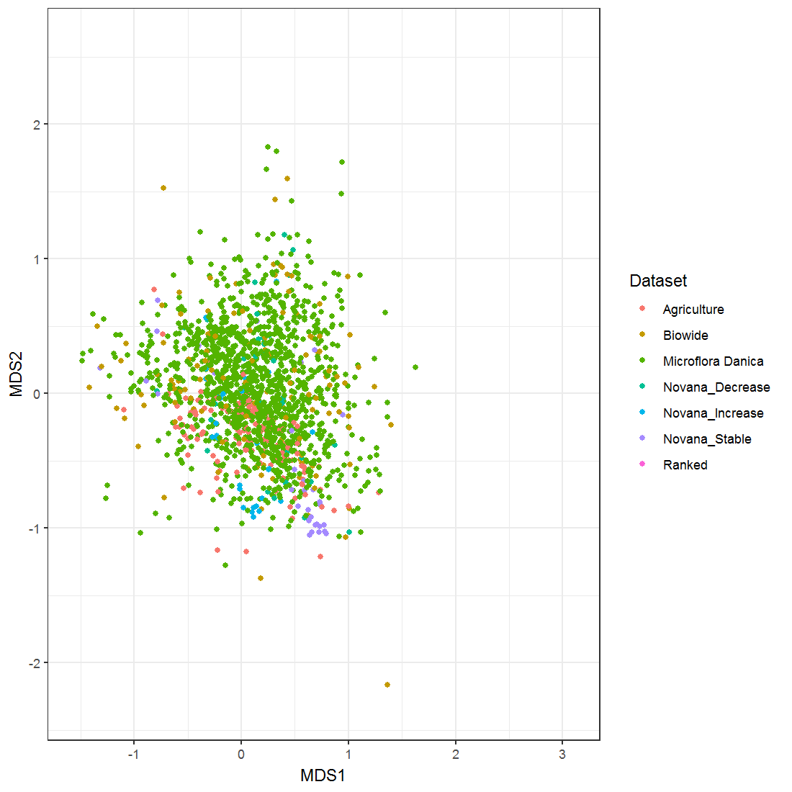

```{r setup, include=FALSE}
knitr::opts_chunk$set(echo = FALSE, warning = FALSE, message = FALSE, cache = TRUE, tidy = TRUE, tidy.opts= list(blank = FALSE, width.cutoff = 60), fig.align='center')
# for shapefile manipulation
library(sf)
# for data wrangling and ploting
library(tidyverse)
# for community analysis
library(vegan)
# for efficient data manipulation
library(data.table)
# For clean summaries
library(broom)
```

```{r ReadDk}
Denmark <- readRDS("DK_Shape.rds")
AllData <- readRDS("AllData3.rds") %>% 
  mutate(Dataset = fct_relevel(Dataset, "Microflora Danica", "Biowide", "Agriculture", "Novana_Stable", "Novana_Increase", "Novana_Decrease", "Novana"))
```

## Points already planned to be sampled

```{r}
Prior <- AllData %>% 
  dplyr::filter(Dataset %in% c("Microflora Danica", "Biowide", "Agriculture"))
```

```{r}
ggplot() +
  geom_sf(data = Denmark) + 
  geom_sf(data = Prior, aes(color = Dataset)) +
  theme_bw() 
```

## Objective

* Find the points furthest away environmentally from the current points
* Find the most stable, more increase and more decrease of species Richness
* Candidate points extracted from Novana dataset
* `r prettyNum((nrow(AllData) - nrow(Prior)),big.mark = ",")` Candidate points

```{r fig.height=3.5}
ggplot() +
  geom_sf(data = Denmark) + 
  geom_sf(data = dplyr::filter(AllData, Dataset %in% c("Novana_Stable", "Novana_Increase", "Novana_Decrease", "Novana"))) +
  theme_bw() 
```

# Environmental distance

## Methods

* Furthest points in environmental space
  + Mean anual temperature
  + Temperature seasonality
  + Annual precipitation
  + Precipitation seasonality
  + Topographic wetness index
  + Vegetation density
  + pH Surface
  + pH deep
  + Bin of canopy height (<1,1-3, 3-10, >10)
  + Soil texture (Clay, Sand, Silt)
  + Heat load index
  + Slope

## Map of selected points

```{r}
OnlyPoints <- readRDS("Onlypoints4.rds")

Prior <- OnlyPoints %>% dplyr::filter(Rank == 0)

New <- OnlyPoints  %>% dplyr::filter(Rank > 0 & Rank <= 750)

ggplot() + 
  geom_sf(data = Denmark) +
  geom_sf(data = Prior) + 
  geom_sf(data = New, aes(color = Rank)) + 
  #  scale_color_gradient(low = "#fff5f0", high = "#cb181d") + 
  scale_colour_stepsn(colours = c('#e41a1c','#377eb8','#4daf4a','#984ea3')) +
  theme_bw()
```

## NMDS of selected points

```{r}
ggplot(Prior, aes(x = MDS1, y = MDS2)) +
  geom_point(aes(color = Dataset)) +
  theme_bw() +
  geom_point(data = New)
```

## First 50 points

```{r, out.width= "50%"}

```

## Environmental space

```{r}
OnlyPoints <- OnlyPoints %>% mutate(Selection_time  = ifelse(Rank <= 1, "Prior", "New"))

library(GGally)

ggpairs(OnlyPoints, columns = c(6:10,16:24), ggplot2::aes(colour=Selection_time, alpha = 0.3)) 
```


# Selection by species richness change

## Method

* From Novana dataset select the point with at least 4 years of sampling
* Make a linear regression between Richness (Only positive species), and year
* If slope is non significative the sampling point is considered to be stable
  + Select the 34 lowest absolute value slope
* If slope is significative and positive the sampling point is considered to be of increasing richness
  + Select the 34 highest slope value
* If slope is significative and negative the sampling point is considered to be of decreasing richness
  + Select the 34 lowest slope value
  
## Selected points

```{r, cache=TRUE}
NovanaFiles <- list.files(path = "Novana/", full.names = T)

ForRichness <- fread(file=NovanaFiles[1], na.strings = "mv") %>% as.data.frame()  %>%
  unite(col = "ID", site, plot)  %>% 
  dplyr::select(ID, antalstjernearter, year) %>% 
  rename(Richness = antalstjernearter)  %>% 
  dplyr::filter(!is.na(Richness))

Ns <- ForRichness %>% 
  group_by(ID) %>% 
  summarise(n = n()) %>% 
  arrange(n) 
## Keep only the IDs of the sites that have been sampled 4 or more times
TestIDs <- Ns %>% dplyr::filter(n >= 4) %>% pull(ID)

For_Analysis <- ForRichness %>% 
  dplyr::filter(ID %in% TestIDs) %>% 
  group_split(ID)
Analysis_Name <- For_Analysis %>% 
  purrr::map(~pull(.x, ID)) %>% 
  reduce(c) %>% 
  unique()

Analysis <- For_Analysis %>% 
  purrr::map(~lm(Richness ~ year, data = .x)) %>% 
  purrr::map(broom::tidy) %>% 
  purrr::map(~dplyr::filter(.x, term == "year")) %>% 
  purrr::map2(Analysis_Name, ~mutate(.x, ID = .y)) %>% 
  reduce(bind_rows)

Stable <- Analysis %>% 
  dplyr::filter(p.value >= 0.05) %>% 
  dplyr::mutate(estimate)

Upwards <- Analysis %>% 
  dplyr::filter(p.value < 0.05, estimate > 0)

Downwards <- Analysis %>% 
  dplyr::filter(p.value < 0.05, estimate < 0)

Stable <- Stable %>% 
  dplyr::mutate(AbsSlope = abs(estimate)) %>% 
  dplyr::slice_min(order_by = AbsSlope, n = 34)

StableTrends <- For_Analysis %>% 
  reduce(bind_rows) %>% 
  dplyr::filter(ID %in% Stable$ID) %>% 
  mutate(Class = "Stable")

Upwards <- Upwards %>% 
    dplyr::slice_max(order_by = estimate, n = 34)

UpwardsTrends <- For_Analysis %>% 
  reduce(bind_rows) %>% 
  dplyr::filter(ID %in% Upwards$ID)  %>% 
  mutate(Class = "Increase")

Downwards <- Downwards %>% 
    dplyr::slice_min(order_by = estimate, n = 34)

DownwardsTrends <- For_Analysis %>% 
  reduce(bind_rows) %>% 
  dplyr::filter(ID %in% Downwards$ID) %>% 
  mutate(Class = "Decrease")

DiversTrend <- list(StableTrends, DownwardsTrends, UpwardsTrends) %>% 
  reduce(bind_rows)

ggplot(DiversTrend, aes(x = year, y = Richness)) + geom_path(aes(group= ID, color = ID)) + geom_point(aes(group= ID, color = ID)) + theme_bw() + theme(legend.position = "none") + facet_wrap(~Class)
```

## Selected points (map)

```{r}
Richness <- AllData %>% 
  dplyr::filter(Dataset %in% c("Novana_Stable", "Novana_Increase", 
"Novana_Decrease")) %>% 
  mutate(Dataset = str_replace_all(Dataset, "Novana_", " ")) %>% 
  rename(Richness = Dataset)
```

```{r}
ggplot() +
  geom_sf(data = Denmark) + 
  geom_sf(data = Richness, aes(color = Richness)) +
  theme_bw() 
```


## Final map

```{r, cache=FALSE}
library(leaflet)
Test <- read_sf("Ranked4.shp") %>% st_transform(crs = "+proj=longlat +datum=WGS84") 

l <-leaflet()

esri <- grep("^Esri", providers, value = TRUE)
esri <- esri[c(5,2,4,10)]

pal <- colorQuantile(palette = c('#d73027','#fc8d59','#fee08b','#ffffbf','#d9ef8b','#91cf60','#1a9850'), Test$Rank, n = 7)

for (provider in esri) {
  l <- l %>% addProviderTiles(provider, group = provider) %>% 
  leaflet::addCircles(data = as_Spatial(Test), color = ~pal(Rank), popup = paste("<b>Ranking:", Test$Rank,"</b>", "<br>",
                           "Canopy height:", Test$Cnpy_Hg, "<br>",
                           "Sand:", (Test$afsandn + Test$agsandn)))
}

l <- l %>%
  addLayersControl(baseGroups = names(esri),
                   options = layersControlOptions(collapsed = TRUE)) %>%
  addMeasure(position = "topleft",
             primaryLengthUnit = "meters",
             primaryAreaUnit = "hectares")

l %>% addLegend("bottomright", pal = pal ,title = "Rank",opacity = 1, values = Test$Rank) %>%
  addEasyButton(easyButton(
    icon="fa-crosshairs", title="Locate Me",
    onClick=JS("function(btn, map){ map.locate({setView: true}); }")))
```

