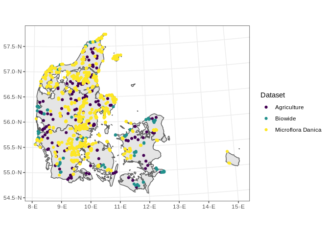

Site selection for field work
================

## Steps to follow in this document:

1.  Will divide the NOVANA dataset in two datasets, the “Regularly
    sampled” and the “unfrequently sampled”
2.  Within the “Regularly sampled”, I will pick the top n samples in
    terms of directionality for biodiversity, so the top lets say the
    top 34 in gained diversity, top 34 in lost biodiversity, and top 34
    in stability, so that is 103 sites.
3.  The selected points in step 2 will be added to the Sampled dataset
    together with the Biowide, Microflora danica, and Agriculture sites
    (That is how I am calling the Moegens/ Mette sites)
4.  Of all remaining sites either in the regularly sampled and
    unfrequently sampled figure out the top 1000 that are the furthest
    away environmentally (Ranked)
5.  Hopefully after Monday’s meeting with Christian, further use the
    abiotic variables in NOVANA, to rerank the top 1000 using the
    abiotic dataset within the abiotic dataset

## load data and packages

### Load needed packages:

``` r
# for shapefile manipulation
library(sf)
# for data wrangling and ploting
library(tidyverse)
# for community analysis
library(vegan)
# for efficient data manipulation
library(data.table)
```

### Load and modify datasets

Read a polygon of Denmark to the show where the points will be

``` r
Denmark <- readRDS("DK_Shape.rds")
```

Read in the *biowide* dataset together and modify it to have only a
unique identifier, a dataset column and the coordinates as an SF object.

``` r
# read in the data
Biowide <- read_sf("Biowide_Naturtyper.shp")

# Drop the first row
Biowide <- Biowide[-1,] %>% 
  # add the Dataset column
  mutate(Dataset = "Biowide") %>% 
  # Select only that column
  dplyr::select(Dataset) %>%
  # generate an unique identifier for each row
  tibble::rowid_to_column(var = "ID") %>% 
  # Add the Biowide prefix to the ID
  mutate(ID = paste0("Biowide_", ID))
```

Read in the *Agriculture* dataset together and modify it to have only a
unique identifier, a dataset column and the coordinates as an SF object.

``` r
# Read in the dataset
AgriculturalPoints <- read_sf("150pkt/150pkt_indenforpoly_13042021.shp") %>% 
  # Generate the Dataset column
  mutate(Dataset = "Agriculture") %>%
  # Select only that column
  dplyr::select(Dataset) %>%
  # Generate a unique identifier for the dataset
  tibble::rowid_to_column(var = "ID") %>% 
  # Add the Ag prefix for this dataest
  mutate(ID = paste0("Ag_", ID))
```

Read in the *Microflora danica* dataset together and modify it to have
only a unique identifier, a dataset column and the coordinates as an SF
object.

``` r
# Read in the dataset as a data frame
MicroFlora <- read_csv("natsoil.csv") %>% 
  # eliminate the points with lat and lon = 0
  dplyr::filter(latitude != 0 & longitude != 0) %>%
  # Transform to sf
  st_as_sf(coords  = c(4,3), crs = "+proj=longlat +ellps=WGS84 +datum=WGS84 +no_defs +towgs84=0,0,0") %>%
  # Reproject 
  st_transform(crs = st_crs(Biowide)) %>% 
  # Add dataset column
  mutate(Dataset = "Microflora Danica") %>%
  # Keep only the dataset column
  dplyr::select(Dataset) %>%
  # Generate a unique identifier for the dataset
  tibble::rowid_to_column(var = "ID") %>% 
  # Add the Micro prefix for this dataest
  mutate(ID = paste0("Micro_", ID))
```

## Join together and visualize

``` r
AllData <- list(Biowide, AgriculturalPoints, MicroFlora) %>% 
  # join all together
  purrr::reduce(rbind)
```

<!-- -->
